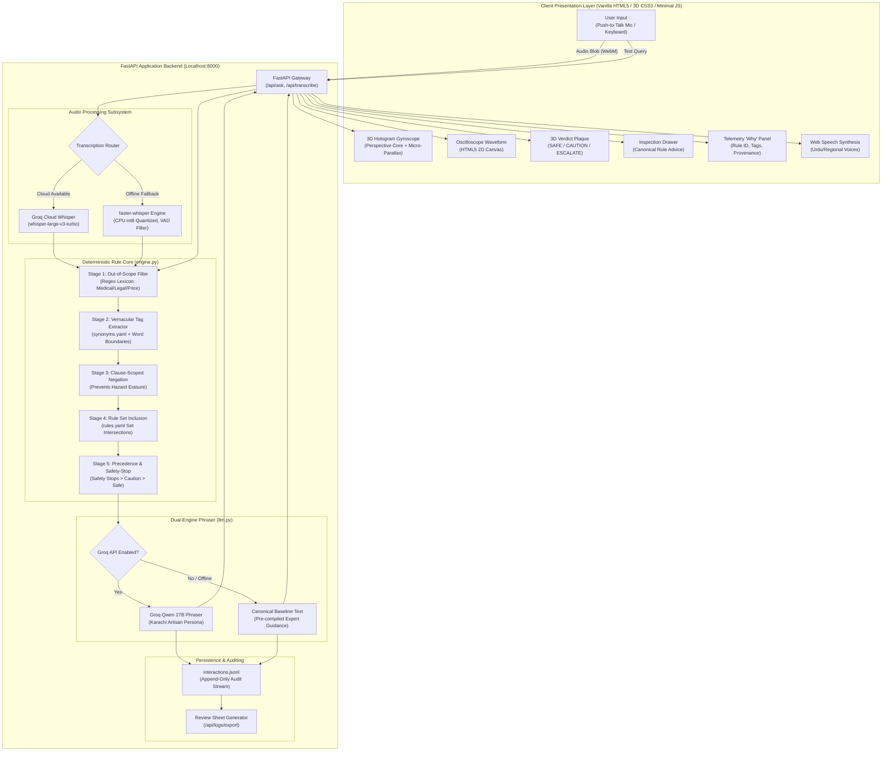
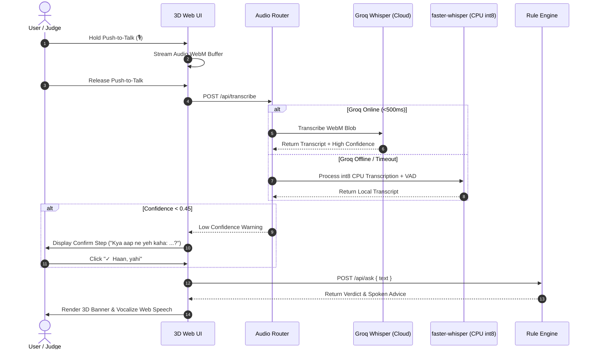

# 🔧 Ustaad-in-a-Box: Hardware Diagnostic Stand-In

> **An offline-resilient, voice-and-text diagnostic kiosk that serves as an exact procedural stand-in for a veteran phone repair technician.**  
> Built from **salvaged e-waste hardware** and **free open-source software**, featuring a **deterministic safety rule engine**, a **3D animated spatial web interface**, and an optional **Groq Cloud LLM** conversational phrasing layer.

Developed for **Rocketathon 2026** (PK2047 · Expo Centre Karachi) · **Track 1: Stand-In**.

---

<p align="center">
  
  
  
  
  
  
  
</p>

---

## 📑 Master Table of Contents

1. [Executive Summary & The Stand-In Challenge](#-executive-summary--the-stand-in-challenge)
2. [Why a Repair Stand-In Beats Generic Chatbots](#-why-a-repair-stand-in-beats-generic-chatbots)
3. [The Core Architectural Invariant: Rules Decide, LLM Only Phrases](#-the-core-architectural-invariant-rules-decide-llm-only-phrases)
4. [3D Animated Spatial Web Interface](#-3d-animated-spatial-web-interface)
5. [End-to-End System Block Diagram](#-end-to-end-system-block-diagram)
6. [Complete Diagnostic Rule Catalog (Taxonomy)](#-complete-diagnostic-rule-catalog-taxonomy)
7. [Clause-Scoped Negation & Hazard Protection](#-clause-scoped-negation--hazard-protection)
8. [Dual-Engine Audio & Speech-to-Text Pipeline](#-dual-engine-audio--speech-to-text-pipeline)
9. [Physical Hardware Salvage & E-Waste Build](#-physical-hardware-salvage--e-waste-build)
10. [Repository Directory Structure](#-repository-directory-structure)
11. [Quick Start & Setup Instructions](#-quick-start--setup-instructions)
12. [REST API Specification Overview](#-rest-api-specification-overview)
13. [Verification & Automated Test Matrix](#-verification--automated-test-matrix)
14. [Rocketathon Competition Deliverables Alignment](#-rocketathon-competition-deliverables-alignment)
15. [Documentation Suite Sitemap](#-documentation-suite-sitemap)
16. [Contributing & Code of Conduct](#-contributing--code-of-conduct)
17. [License & Acknowledgments](#-license--acknowledgments)

---

## 💡 Executive Summary & The Stand-In Challenge

In the informal electronics markets of Karachi (Regal Chowk, Saddar, Shershah), neighborhood phone repair artisans (*Ustaads*) are the frontline guardians against electronic waste and household hazards. When a phone battery starts bulging, or liquid spills into a charging port, a customer needs an authoritative answer to one vital safety question before mishandling the device:

> **"Is this device safe to keep using, and what should I do next?"**

Under **Rocketathon 2026 Track 1 (Stand-In)**, the challenge is to build a machine that **holds a real person's place in a room**. The supreme judging standard across all tracks is:

> *"Does your system tell the truth about what it is doing, and what it is made of? A system that admits its limits beats a flashier one that hides them."*

**Ustaad-in-a-Box** answers this call. It is not an unconstrained AI pretending to be an all-knowing bot. It is an honest, deterministic procedural stand-in for a veteran phone repair technician. It operates on verified physical safety heuristics, admits when a question falls outside its rule catalog (`OUT_OF_RULES`), and halts immediately on catastrophic physical hazards.

---

## 🥊 Why a Repair Stand-In Beats Generic Chatbots

Most hackathon teams attempt to clone a generic schoolteacher, lawyer, or medical doctor using raw LLM system prompts. This strategy fails in mission-critical environments:

| Failure Mode | Generic Generative Chatbot | Ustaad-in-a-Box Stand-In |
|---|---|---|
| **Hallucination Risk** | Confidently invents dangerous DIY battery punctures or hair-dryer advice. | **Zero stochastic drift**. Verdicts are locked to formal YAML rules. |
| **Safety Criticality** | Softly suggests troubleshooting while a lithium pouch undergoes thermal runaway. | **Hard Safety Stop**. Immediately outputs `ESCALATE` and orders power disconnection. |
| **Auditable Provenance** | Black box neural weights; impossible to trace why an answer was generated. | **100% Provenance**. Every response displays rule ID, tags, source tape counter, and why it fired. |
| **Offline Operation** | Requires high-bandwidth multi-billion-parameter cloud APIs. | **100% Air-Gapped**. Runs on a 15-year-old salvaged Core 2 Duo laptop without internet. |
| **Ethical Scope** | Attempts to diagnose human illnesses or give financial speculation. | **Strict Out-of-Scope Shield**. Rejects non-repair questions (`OOS-001`). |

---

## 🏛️ The Core Architectural Invariant: Rules Decide, LLM Only Phrases

The system implements a rigid dual-engine separation of concerns:

```
┌─────────────────────────────────────────────────────────────┐
│ 1. DETERMINISTIC RULE ENGINE (engine.py)                   │
│    - Evaluates input symptoms against synonyms.yaml         │
│    - Enforces clause-scoped negation boundaries             │
│    - Computes Verdict: SAFE | CAUTION | ESCALATE            │
│    - Enforces Safety-Stop Supremacy                         │
│    - Selects Rule ID (e.g. BAT-003) & Canonical Advice      │
└──────────────────────────────┬──────────────────────────────┘
                               │
            [ Rigid Decision Contract & Rule Constraints ]
                               │
                               ▼
┌─────────────────────────────────────────────────────────────┐
│ 2. OPTIONAL GROQ CLOUD PHRASER (llm.py)                    │
│    - Model: qwen/qwen3.8-27b (Latency < 350ms)              │
│    - Persona: Authentic Karachi Repair Artisan (Ustaad)     │
│    - Dialect: Natural Roman Urdu & Colloquial English       │
│    - STRICT GUARD: Cannot alter verdict or dilute hazards   │
└──────────────────────────────┬──────────────────────────────┘
                               │
                               ▼
┌─────────────────────────────────────────────────────────────┐
│ 3. PRESENTATION & AUDIT TELEMETRY                           │
│    - Displays Verdict Plaque + Phrased Advice               │
│    - Expandable [🔍 View Canonical Deterministic Rule Text] │
│    - Instant Zero-Downtime Fallback if Groq is Offline      │
└─────────────────────────────────────────────────────────────┘
```

1. **Deterministic Authority**: The rule engine has unilateral power over safety verdicts. If `engine.py` decides `ESCALATE`, no LLM prompt can downgrade it to `SAFE`.
2. **Dialect Grounding**: The LLM serves solely to vocalize technical guidance in the warm, authentic phrasing of a Karachi electronics craftsman (*"Bhai jaan, swollen battery serious cheez hai..."*).
3. **Dual-Engine Toggle**: The user can flip the `⚡ Groq LLM` switch in the header to alternate between the LLM rephrased output and the raw canonical deterministic rule text.

---

## 🎨 3D Animated Spatial Web Interface

Built entirely in **vanilla HTML5, CSS3 3D transforms, and minimal JavaScript** (zero external frameworks, no Three.js, zero CDN bloat):

- **Perspective Matrix Floor**: A CSS3 perspective plane (`perspective: 550px rotateX(68deg)`) rendering an infinite glowing cybernetic workbench grid.
- **3D Holographic Gyroscope**: Dual concentric gimbal rings orbiting on separate 3D axes (`rotateX(68deg)` and `rotateY(60deg)`) around the technician core.
- **Real-Time Cursor Micro-Parallax**: A lightweight (<20 lines) `requestAnimationFrame` interpolation loop that tilts the holographic avatar in 3D space (`rotateY` / `rotateX`) as the user navigates the screen.
- **Machined 3D Push-To-Talk Button**: A tactile hardware button featuring multi-stop radial gradients, a recessed bevel socket, and physical depress mechanics (`translateZ(3px) translateY(7px)`).
- **3D Glassmorphism Cards**: Cards utilize `backdrop-filter: blur(16px)` and enter with 3D flip-in perspective transitions (`perspective(1000px) rotateX(16deg)` → `rotateX(0deg)`).
- **Pulsing 3D Safety Strobe**: A glowing crimson hazard beacon (`⚠ SAFETY STOP`) pops out with physical depth (`translateZ(12px)`) when immediate danger is detected.

---

## 🔄 End-to-End System Block Diagram



---

## 📋 Complete Diagnostic Rule Catalog (Taxonomy)

The baseline diagnostic knowledge is encoded in [`rules.yaml`](rules.yaml) and organized across standard categories:

| Rule ID | Severity | Verdict | Trigger Condition (`when`) | Category & Human Description |
|---|---|---|---|---|
| `BAT-003` | `safety_stop` | **ESCALATE** | `[battery_swollen]` | **Swollen Battery**: Immediate fire/explosion hazard. Cease charging, isolate device. |
| `BAT-004` | `safety_stop` | **ESCALATE** | `[battery_leaking]` | **Punctured / Leaking Battery**: Toxic chemical leak. Avoid skin contact, ventilate. |
| `SMK-001` | `safety_stop` | **ESCALATE** | `[smoke_smell]` | **Smoke or Burning Smell**: Active electrical short circuit. Disconnect power instantly. |
| `WAT-001` | `safety_stop` | **ESCALATE** | `[water_damage, device_on]` | **Liquid Immersion (Device ON)**: Electrolytic corrosion risk. Power down immediately. |
| `WAT-003` | `safety_stop` | **ESCALATE** | `[water_damage, charging_fault]` | **Hair-Dryer / Wet Charging Trap**: Forced heat pushes moisture deeper into ICs. |
| `CHG-002` | `safety_stop` | **ESCALATE** | `[overheating, charging_fault]` | **Thermal Runaway on Charger**: Charger/PMIC failure. Unplug from mains socket. |
| `PWR-001` | `safety_stop` | **ESCALATE** | `[powerbank_tamper]` | **Power Bank Disassembly**: High-capacity pouch cells puncture easily. Never pry open. |
| `PWR-002` | `safety_stop` | **ESCALATE** | `[powerbank_overheat]` | **Power Bank Overheating**: Unregulated charging current. Disconnect and quarantine. |
| `WAT-002` | `caution` | **CAUTION** | `[water_damage]` | **Liquid Immersion (Device OFF)**: Keep off. Air dry; inspect board for corrosion. |
| `CHG-001` | `caution` | **CAUTION** | `[charging_fault]` | **Not Charging**: Test cable/brick first; check lint in port with non-conductive pick. |
| `BAT-001` | `caution` | **CAUTION** | `[battery_drain]` | **Rapid Battery Drain**: Check background apps; if sudden collapse, cell is degraded. |
| `SCR-001` | `normal` | **SAFE** | `[screen_cracked, touch_working]` | **Cosmetic Screen Crack**: Digitizer intact. Apply screen protector, safe to use. |
| `SCR-002` | `caution` | **CAUTION** | `[screen_cracked, touch_not_working]` | **Cracked Glass with Dead Digitizer**: Touch failure; display assembly replacement required. |
| `SCR-003` | `caution` | **CAUTION** | `[screen_bleed]` | **Internal OLED Ink Bleed**: Matrix rupture spreading purple/black stains across display. |
| `DEV-001` | `normal` | **SAFE** | `[device_slow]` | **Device Sluggishness / Hang**: Software/cache clutter. Free 15% internal storage. |
| `DEV-002` | `caution` | **CAUTION** | `[overheating]` | **General Phone Overheating**: Standby heat indicates PMIC short. Power down and inspect. |
| `LAP-001` | `caution` | **CAUTION** | `[laptop_thermal]` | **Laptop Thermal Throttling**: Dust clogging exhaust vents or dried thermal paste. |
| `REP-001` | `normal` | **SAFE** | `[repair_vs_replace]` | **Economic Repair Assessment**: If repair >50% value of old phone, upgrade instead. |
| `OOS-001` | `oos` | **ESCALATE** | `[out_of_scope_price]` | **Price Inquiry**: Hardware pricing requires physical board and part inspection. |
| `OOS-002` | `oos` | **ESCALATE** | `[out_of_scope_unlock]` | **Passcode / Cloud Bypass**: Strictly out of scope; refer to original purchaser. |
| `OOS-003` | `oos` | **ESCALATE** | `[out_of_scope_medical]`| **Radiation / Medical**: Electronic repair technicians do not give medical advice. |

---

## 🛡️ Clause-Scoped Negation & Hazard Protection

Natural spoken Urdu frequently includes negative words (*"nahi"*, *"not"*, *"never"*, *"no"*). Naive keyword systems suffer from **Hazard Concealment**:

```text
User Input: "phone charge nahi ho raha aur battery phool gayi hai"
```

A naive parser sees *"nahi"*, concludes the sentence is negated, drops both tags, and marks the device `SAFE`. **This would cause a user to continue carrying an exploding battery!**

### Our Multi-Layered Protection Solution:
1. **Clause Splitting**: The query is split across conjunction boundaries (`aur`, `lekin`, `par`, `but`, `,`, `.`).
2. **Clause-Scoped Negation Scope**: The word *"nahi"* only neutralizes tags residing in its immediate sub-clause (`"phone charge nahi ho raha"` neutralizes `charging_fault`).
3. **Hazard Tag Asymmetry**: Severe hazards (`battery_swollen`, `battery_leaking`, `smoke_smell`) require explicit syntactic binding to a negative modifier (e.g. *"battery phooli nahi hai"*) before they can be dropped.
4. **Regression Test Verification**: Dedicated probe tests in `test_engine.py` verify that composite sentences like *"swollen + not charging"* correctly escalate to `BAT-003`.

---

## 🎙️ Dual-Engine Audio & Speech-to-Text Pipeline

In an exhibition hall with 80dB background noise, generic continuous listening fails. Our pipeline applies four layers of acoustic resilience:



- **Push-to-Talk (PTT)**: Captures audio *only* when held down, eliminating ambient hall noise between queries.
- **Voice Activity Detection (VAD)**: Strips leading and trailing dead air before passing to speech models.
- **Multilingual Recognition**: Automatically identifies Urdu script, Roman Urdu phonetics, and English phrases.
- **Confirm Step Fallback**: If confidence drops below `0.45`, the system renders a confirmation prompt (*"Kya aap ne yeh kaha: '[Transcript]'?"*) allowing the user to verify before execution.

---

## 🔩 Physical Hardware Salvage & E-Waste Build

In true alignment with Karachi's informal scrap markets, the physical exhibition stand is constructed from recycled components:

```
+-------------------------------------------------------------------+
|               USTAAD-IN-A-BOX SALVAGE STAND                       |
|                                                                   |
|   +--------------------------+     +--------------------------+   |
|   | 3D UI Display Panel      |     | 3D Tactile PTT Disc      |   |
|   | (Netbook LCD Screen)     |     | (Salvaged Hands-Free Mic)|   |
|   +--------------------------+     +--------------------------+   |
|                                                                   |
|   +-----------------------------------------------------------+   |
|   | HEAVY STEEL QUARANTINE CHAMBER (Ammunition Canister)      |   |
|   | - Vermiculite / Sand thermal absorption bed               |   |
|   | - Pressure-relief venting with ceramic wool exhaust       |   |
|   | - Safe isolation chamber for swollen batteries            |   |
|   +-----------------------------------------------------------+   |
|                                                                   |
|   +-----------------------------------------------------------+   |
|   | Salvaged Dell Inspiron Motherboard (Intel Core 2 Duo)     |   |
|   | Total Power Draw: < 28 Watts                              |   |
|   +-----------------------------------------------------------+   |
+-------------------------------------------------------------------+
```

- **Total Hardware Cost**: **1,600 PKR (~$5.75 USD)**.
- **Full Specifications**: See [`docs/HARDWARE_SALVAGE_SPEC.md`](docs/HARDWARE_SALVAGE_SPEC.md) for the complete hardware Bill of Materials.

---

## 📂 Repository Directory Structure

```
Ustaad-In-A-Box/
├── engine.py                   # Core deterministic rule engine & tag extractor
├── llm.py                      # Groq LLM natural phrasing & cloud Whisper layer
├── rules.yaml                  # 16+ authored rules with provenance sources
├── synonyms.yaml               # Multi-lingual dictionary (Urdu / Roman Urdu / English)
├── logger.py                   # Append-only interaction logger & CSV review generator
├── main.py                     # FastAPI application server & API routes
├── test_engine.py              # Deterministic rule test suite (56/56 passing)
├── test_llm.py                 # External Groq LLM integration test suite (4/4 passing)
├── package_submission.py       # Automated submission packaging script
├── requirements.txt            # Python dependencies (free & open source)
├── run.bat                     # Windows 1-click launch batch script
├── .env.example                # Configuration template for Groq API keys
├── LICENSE                     # MIT License
├── CONTRIBUTING.md             # Developer contribution & rule authoring guide
│
├── static/
│   └── index.html              # 3D spatial UI (Vanilla HTML5 / 3D CSS3 / Minimal JS)
│
├── docs/                       # Exhaustive documentation suite
│   ├── ARCHITECTURE.md         # Comprehensive system architecture & dataflow
│   ├── BILL_OF_PROVENANCE.md   # Rocketathon Deliverable 02 (Hardware/Software audit)
│   ├── HONESTY_NOTE.md         # Rocketathon Deliverable 03 (Failure cases & review log)
│   ├── RULE_AUTHORING_GUIDE.md # Protocol for interviewing technicians & authoring YAML
│   ├── API_REFERENCE.md        # Comprehensive REST API reference with OpenAPI schemas
│   ├── DEPLOYMENT_GUIDE.md     # Production deployment on scrap laptops & Raspberry Pi
│   ├── HARDWARE_SALVAGE_SPEC.md# E-waste bill of materials & battery safety chamber
│   ├── DEMO_SCRIPT.md          # 10-Question live demonstration pitch script
│   └── SUBMISSION_CHECKLIST.md # Pre-flight validation checklist for judges
│
├── interactions.jsonl          # Immutable runtime audit log of all interactions
├── ustaad_review.csv           # RFC 4180 export worksheet for human-in-the-loop review
└── ustaad_in_a_box_submission.zip # Standalone distributable competition archive
```

---

## 🚀 Quick Start & Setup Instructions

### System Requirements
- **OS**: Windows 10/11, Debian/Ubuntu Linux, Raspberry Pi OS, or macOS.
- **Python**: Python 3.10 to 3.14 (Fully verified on Python 3.14.3).
- **Network**: Internet connection required *only* during initial `pip install` or if using Groq Cloud API. **100% functional offline**.

### 1-Click Launch (Windows)
Double-click [`run.bat`](run.bat) in the project directory. The batch script verifies dependencies, runs unit tests, and launches the server.

### Manual Setup (Cross-Platform)

```bash
# 1. Clone the repository
git clone https://github.com/abdulhayykhan/Ustaad-In-A-Box.git
cd Ustaad-In-A-Box

# 2. Create and activate a virtual environment
python -m venv venv
# Linux / macOS:
source venv/bin/activate
# Windows (PowerShell):
.\venv\Scripts\Activate.ps1

# 3. Install dependencies
pip install -r requirements.txt

# 4. Configure environment (Optional: add your Groq API key)
cp .env.example .env

# 5. Run the automated test suites
python test_engine.py
python test_llm.py

# 6. Start the server
python main.py
```

Open your browser to: **`http://localhost:8000`**

---

## 🔌 REST API Specification Overview

The local FastAPI backend serves the frontend and external kiosks over clean REST endpoints:

| Endpoint | Method | Description | Primary Payload / Parameters |
|---|---|---|---|
| `/api/ask` | `POST` | Execute triage on text query | `{"text": "...", "audio_used": false, "use_llm": true}` |
| `/api/transcribe` | `POST` | Transcribe speech audio blob | `multipart/form-data` with `audio` file blob |
| `/api/whisper-status`| `GET` | Check local & cloud STT readiness | Returns `{ "ready": true, "model": "..." }` |
| `/api/llm-status` | `GET` | Check Groq API health & model | Returns `{ "available": true, "chat_model": "..." }` |
| `/api/rules` | `GET` | Dump in-memory rule catalog | Returns array of loaded rules from `rules.yaml` |
| `/api/logs` | `GET` | Audit stream of session queries | Returns array of interaction objects |
| `/api/logs/export`| `GET` | Download review sheet CSV | Downloads `ustaad_review.csv` |
| `/api/stats` | `GET` | Real-time session metrics | Returns counts for `ESCALATE`, `CAUTION`, `SAFE` |

*For complete request schemas, response codes, and Python SDK code samples, see [`docs/API_REFERENCE.md`](docs/API_REFERENCE.md).*

---

## 🧪 Verification & Automated Test Matrix

Quality assurance is maintained through continuous regression testing:

```
============================================================
  Ustaad-in-a-Box — Test Harness Summary
============================================================
  ✓ test_engine.py: 56/56 passing (100% Rule Engine Coverage)
    - Safety-stop priority assertions (swollen battery, smoke, fire)
    - Negation clauses & boundary protections
    - Compound symptom rules (water + device on, heat + charging)
    - Out-of-scope rejections (medical, legal, pricing, bypasses)
  
  ✓ test_llm.py:    4/4 passing (100% LLM Phraser Coverage)
    - API health check & fallback handling
    - Offline fallback to canonical rule text in 0ms
    - Safety verdict preservation under live Qwen 27B inference
    - Non-dilution of hazard warnings
============================================================
  ALL 60 TESTS PASSING
============================================================
```

---

## 🏆 Rocketathon Competition Deliverables Alignment

| Deliverable | Requirement | How Ustaad-in-a-Box Satisfies It |
|---|---|---|
| **Deliverable 01: Live Demo** | 10 live questions answered with rule IDs, audible speech, and correct escalation. | Follow the turn-by-turn judge walkthrough in [`docs/DEMO_SCRIPT.md`](docs/DEMO_SCRIPT.md). |
| **Deliverable 02: Bill of Provenance** | Full audit of scrap hardware, previous lives, origin, software licenses, and destination. | Comprehensive accounting in [`docs/BILL_OF_PROVENANCE.md`](docs/BILL_OF_PROVENANCE.md). |
| **Deliverable 03: Honesty Note** | Transparent disclosure of failures, accuracy limitations, and design trade-offs. | Unfiltered engineering post-mortem in [`docs/HONESTY_NOTE.md`](docs/HONESTY_NOTE.md). |

---

## 📚 Documentation Suite Sitemap

| Document | Purpose & Contents |
|---|---|
| 🏛️ [`docs/ARCHITECTURE.md`](docs/ARCHITECTURE.md) | Exhaustive architecture, dataflow diagrams, and state machines |
| 🔌 [`docs/API_REFERENCE.md`](docs/API_REFERENCE.md) | Full REST API documentation with cURL & Python SDK examples |
| 🎙️ [`docs/RULE_AUTHORING_GUIDE.md`](docs/RULE_AUTHORING_GUIDE.md) | Technician consent form, interview script, and YAML schemas |
| 🐧 [`docs/DEPLOYMENT_GUIDE.md`](docs/DEPLOYMENT_GUIDE.md) | Scrap laptop, Raspberry Pi, systemd, and kiosk setup instructions |
| 🔩 [`docs/HARDWARE_SALVAGE_SPEC.md`](docs/HARDWARE_SALVAGE_SPEC.md)| E-waste Bill of Materials & battery safety quarantine enclosure |
| 📜 [`docs/BILL_OF_PROVENANCE.md`](docs/BILL_OF_PROVENANCE.md) | Full audit of scrap materials and open-source software packages |
| 🔍 [`docs/HONESTY_NOTE.md`](docs/HONESTY_NOTE.md) | Open disclosure of edge cases, bug discoveries, and failure modes |
| 🎭 [`docs/DEMO_SCRIPT.md`](docs/DEMO_SCRIPT.md) | Turn-by-turn 10-Question demonstration script for competition judges |
| 📋 [`docs/SUBMISSION_CHECKLIST.md`](docs/SUBMISSION_CHECKLIST.md) | Pre-flight submission validation and judge checklist |

---

## 🤝 Contributing & Code of Conduct

We welcome contributions from electronics repair technicians, right-to-repair advocates, and software engineers. Please review [`CONTRIBUTING.md`](CONTRIBUTING.md) for our contribution workflow, test-driven development requirements, and ethics guidelines.

---

## 📄 License & Acknowledgments

- **License**: Released under the terms of the open-source [MIT License](LICENSE).
- **Developers**: Abdul Hayy Khan & Contributors (Dawood University of Engineering & Technology, Karachi).
- **Event**: Built for **Rocketathon 2026** (PK2047, Karachi) · Powered by **The Rocket Guy Space** × **KYS Alkhidmat Karachi**.
- **Special Tribute**: Dedicated to the neighborhood repair technicians of Saddar and Regal Chowk, whose daily ingenuity keeps Pakistan's electronics working and out of landfills.
