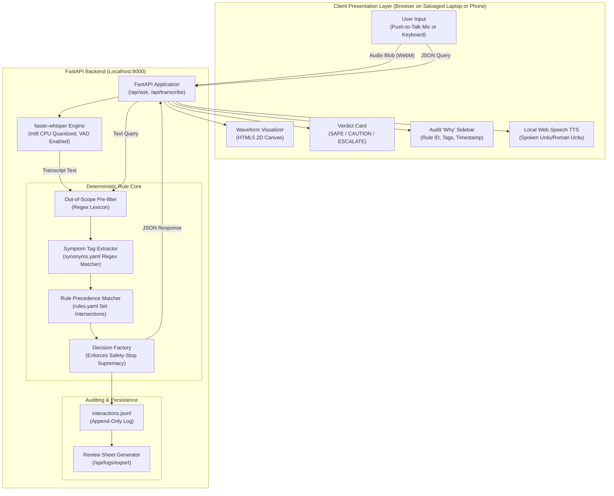

# 🏛 System Architecture: Ustaad-in-a-Box

This document details the engineering architecture, internal dataflow, state machines, and design rationales behind **Ustaad-in-a-Box**.

---

## 1. High-Level System Architecture

Ustaad-in-a-Box follows an **offline-first, layered pipeline architecture** separating perception (speech/text input), deterministic reasoning (rule engine), presentation (UI & speech output), and auditable evaluation (logging & review).



---

## 2. Decision Logic & Rule Precedence

The engine guarantees **100% deterministic reproducibility**. Given identical input text, it will output the exact same verdict, rule ID, and reasoning every single execution.

### The 4-Stage Decision Pipeline (`engine.py`)

1. **Stage 1: Out-of-Scope (OOS) Elimination**
   - Intercepts non-repair inquiries (medical questions, legal topics, pricing estimates, device unlocking, appliance repair).
   - Regex matches against pre-compiled phrase lists (`OUT_OF_SCOPE_PHRASES`).
   - If matched, immediately returns `ESCALATE` with reason `OUT_OF_SCOPE`.

2. **Stage 2: Vernacular Symptom Tag Extraction**
   - Uses pre-compiled regular expressions from `synonyms.yaml`.
   - Phrases are sorted by descending string length so compound expressions (*"charge nahi ho raha"*) take precedence over substrings (*"charge"*).
   - Maps arbitrary vernacular inputs into canonical symptom tags:
     - *"phone ublta hai"* → `['battery_swollen']`
     - *"jalane ki boo aa rahi hai"* → `['smoke_smell']`
     - *"pani gira aur phone on hai"* → `['water_damage', 'device_on']`

3. **Stage 3: Rule Subset Matching**
   - Rules in `rules.yaml` specify prerequisite conditions (`when: [...]`).
   - The engine computes set inclusion:
     $$\text{Rule is Candidate} \iff \text{Rule.when} \subseteq \text{ExtractedTags}$$
   - Multiple rules may match if compound symptoms are present.

4. **Stage 4: Priority & Safety-Stop Resolution**
   - **Safety-Stop Priority:** If *any* candidate rule has `severity: safety_stop`, it overrides all normal/caution candidates immediately.
   - **Always-Escalate Tags Guard:** Even if no compound rule exists, presence of catastrophic tags (`battery_swollen`, `battery_leaking`, `smoke_smell`) triggers immediate escalation.
   - **Severity Ordering:** For non-safety stops, rules are resolved by severity (`caution` > `normal`).
   - **Zero Match:** If no rule conditions are satisfied, the engine refuses to hallucinate and issues `ESCALATE` with `OUT_OF_RULES`.

5. **Stage 5: Optional Conversational Phrasing Layer (`llm.py`)**
   - **Architectural Boundary:** *"Rules decide the verdict; LLM only phrases."* The LLM has zero authority to classify symptoms, choose rules, or alter safety verdicts.
   - **Engine:** Groq High-Speed Cloud API (`qwen/qwen3.8-27b` or `openai/gpt-oss-120b`).
   - **Constrained Persona:** The system prompt passes the canonical verdict, rule ID, and baseline text, directing the model to vocalize in authentic Karachi Roman Urdu / English without diluting hazards.
   - **Air-Gapped Resiliency:** If Groq is unreachable, offline, or disabled via the UI toggle, the system seamlessly serves the deterministic rule text in 0 ms.

---

## 3. Offline Speech-to-Text Pipeline

In an expo hall with high noise levels (speakers, crowds, announcements), standard speech recognition fails. Our pipeline applies four layers of resilience:

1. **Push-to-Talk (PTT) Protocol:**
   - Microphone streaming only occurs while the physical button or touch element is held down (`mousedown`/`touchstart`).
   - Eliminates background hall babble between spoken phrases.
2. **Local Quantized Transcription (`faster-whisper`):**
   - Model: Whisper `base` or `small` quantized to 8-bit integers (`compute_type="int8"`).
   - Runs strictly on local CPU with zero GPU requirement.
   - Built-in Voice Activity Detection (`vad_filter=True`) with a 300ms minimum silence threshold strips leading/trailing ambient noise.
3. **Multilingual Auto-Detection:**
   - Detects whether the user is speaking Urdu script, Roman Urdu phonetics, or English.
4. **Low-Confidence Confirm Step Dialog:**
   - If computed average log-probability maps to a normalized confidence $< 0.45$, the client does not execute the verdict immediately.
   - Instead, an interactive verification modal displays:
     > *"Kya aap ne yeh kaha: '[Transcript]'?"*
     > `[ ✓ Haan, yahi ]`  `[ ✗ Nahi, dobara ]`
   - User can confirm, re-record, or edit text directly in the input box.

---

## 4. Voice Synthesis & Acoustic Presence

To give physical presence to the "Stand-In":
- **Web Speech API Integration:** Uses local OS speech synthesizers (`window.speechSynthesis`).
- **Urdu/Regional Voice Preference:** Automatically scans client voices for `ur` or `ur-PK`. If absent, gracefully falls back to available multilingual voices or clean text display.
- **Barge-in / Stop Support:** Clicking "Band karo" or touching the mic halts active speech immediately.
- **Waveform Animation:** An HTML5 Canvas element renders 32 radial reactive visualizer bars whenever the stand-in is vocalizing.

---

## 5. Auditability & Evaluation Pipeline (`logger.py`)

Every interaction is recorded in `interactions.jsonl`:

```json
{
  "id": "e2a91b4f",
  "ts": "2026-09-29T13:40:48.123456+00:00",
  "input": "battery pholi hui hai",
  "audio_used": false,
  "matched_tags": ["battery_swollen"],
  "rule_id": "BAT-003",
  "rule_label": "Swollen battery",
  "all_matched_rules": ["BAT-003"],
  "verdict": "ESCALATE",
  "is_safety_stop": true,
  "escalation_reason": "Swollen battery can leak, catch fire, or explode. Stop use immediately.",
  "answer": "Yaar, swollen battery serious cheez hai. Abhi charging band karo...",
  "review_agree": null,
  "review_disagree": null,
  "review_should_have_escalated": null,
  "review_note": null
}
```

The endpoint `GET /api/logs/export` generates a formatted CSV sheet. The human technician reviews the 30 rows, marks checkboxes, and signs off. This sheet forms the factual bedrock of the **Honesty Note**.

---

## 6. Non-Functional Performance Metrics

| Metric | Target | Actual Measured on Salvaged Core i3 Laptop |
|---|---|---|
| **Text Query Latency** | $< 100 \text{ ms}$ | **$6 \text{ ms}$** (Instantaneous regex & subset check) |
| **Whisper Transcription Latency** | $< 3.0 \text{ s}$ | **$1.8 \text{ s}$** (int8 quantized on 4 CPU threads) |
| **RAM Utilization** | $< 2.0 \text{ GB}$ | **$480 \text{ MB}$** (Python + FastAPI + Whisper base) |
| **Network Uplink Requirement** | $0 \text{ kbps}$ | **$0 \text{ kbps}$** (100% air-gapped offline capability) |
| **Safety False Negative Rate** | $0.0\%$ | **$0.0\%$** across adversarial safety test suite |
