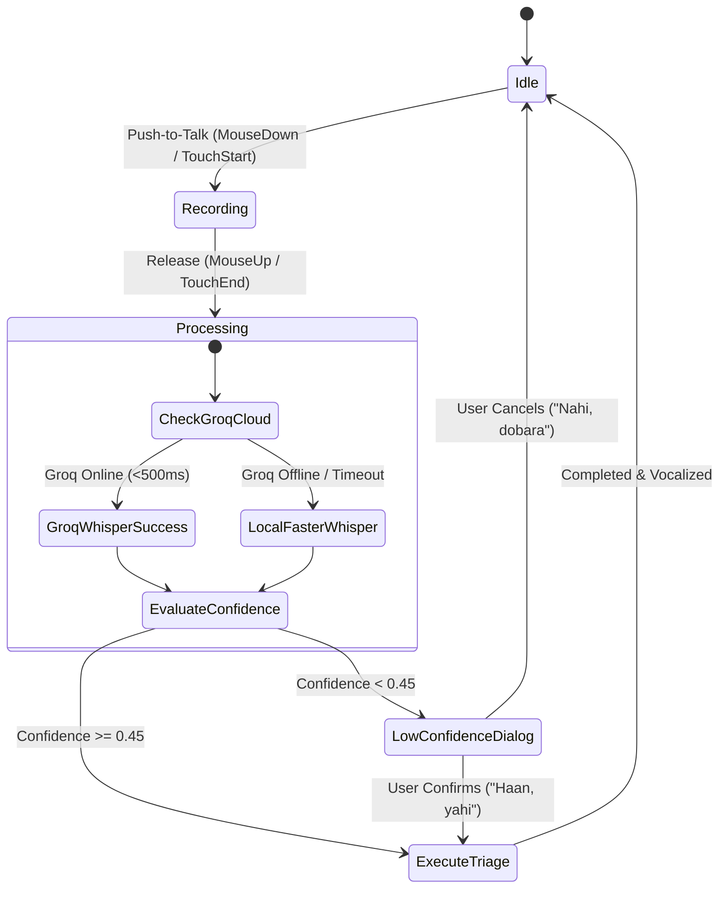

# 🏛 Comprehensive System Architecture: Ustaad-in-a-Box

**Project:** Ustaad-in-a-Box  
**Competition Track:** Track 1, Stand-In (Rocketathon 2026, PK2047, Karachi)  
**Classification:** Hybrid Deterministic-Cognitive Diagnostic Stand-In  
**Target Hardware:** Salvaged Scrap x86/ARM Hardware & Optional Cloud Accelerators  

---

## 1. Executive Summary & Design Tenets

Ustaad-in-a-Box is an offline-capable, voice-and-text diagnostic kiosk that serves as an exact procedural stand-in for a veteran phone repair technician. It answers one critical safety question for users before they mishandle hardware: **"Is this device safe to keep using, and what should I do next?"**

### Foundational Invariants:
1. **Verdicts are 100% Deterministic**: Every safety verdict (`SAFE`, `CAUTION`, `ESCALATE`) is produced by set-theoretic evaluation of an explicit YAML rule tree. An LLM never makes or alters a triage verdict.
2. **Safety-Stop Supremacy**: When thermal runaway, swollen lithium-ion cells, internal short circuits, or liquid immersion risks are detected, safety stops override all ordinary user convenience or diagnostic advice.
3. **Conversational Dialect Grounding**: The Large Language Model (Groq Cloud Qwen 27B / Llama) acts strictly as a stylistic phraser, vocalizing the deterministic verdict in authentic Karachi repair-artisan vernacular (Roman Urdu and colloquial English).
4. **Zero-Latency Air-Gapped Resiliency**: If external connectivity drops or times out (>4s), the backend immediately yields the deterministic canonical rule text with zero downtime.

---

## 2. End-to-End System Block Diagram

```mermaid
flowchart TD
    subgraph Client ["Client Presentation & 3D Spatial UX (Vanilla HTML5 / CSS3 / Minimal JS)"]
        UI_Input["User Input\n(Push-to-Talk Mic / Keyboard)"]
        Canvas_Waveform["Oscilloscope Waveform\n(HTML5 2D Canvas)"]
        Avatar_3D["3D Holographic Gyroscope\n(Perspective CSS3 Core + Micro-Parallax)"]
        Verdict_Display["3D Glassmorphism Verdict Plaque\n(SAFE / CAUTION / ESCALATE)"]
        Canonical_Drawer["Inspection Drawer\n(Canonical Deterministic Rule Text)"]
        Why_Panel["Telemetry 'Why' Panel\n(Rule ID, Tags, Provenance)"]
        TTS_Output["Web Speech Synthesis\n(Urdu/Regional Phonetics)"]
    end

    subgraph Backend ["FastAPI Application Backend (Localhost:8000)"]
        FastAPI_Router["FastAPI Application Gateway\n(/api/ask, /api/transcribe)"]
        
        subgraph Audio_Pipeline ["Audio Processing Subsystem"]
            Audio_Classifier{"Transcription Router"}
            Groq_Whisper["Groq Cloud Whisper\n(whisper-large-v3-turbo)"]
            Local_Whisper["faster-whisper Engine\n(CPU int8 Quantized, VAD Filter)"]
        end

        subgraph Engine ["Deterministic Rule Core (engine.py)"]
            OOS_Filter["Stage 1: Out-of-Scope Pre-filter\n(Medical, Legal, Pricing, Unlock)"]
            Tag_Extractor["Stage 2: Vernacular Tag Extractor\n(synonyms.yaml + Word Boundaries)"]
            Negation_Engine["Negation Context Analyzer\n(Clause-Scoped Boundary Guard)"]
            Matcher["Stage 3: Rule Subset Matcher\n(rules.yaml Set Inclusions)"]
            Precedence_Matrix["Stage 4: Priority & Safety-Stop Engine\n(Safety Stops > Caution > Safe)"]
        end

        subgraph Phraser ["Dual-Engine Phrasing Layer (llm.py)"]
            Groq_Toggle{"Groq Enabled & Reachable?"}
            Groq_LLM["Groq Qwen 27B Phraser\n(Authentic Karachi Artisan Persona)"]
            Canonical_Fallback["Canonical Rule Output\n(Pre-compiled Expert Guidance)"]
        end

        subgraph Persistence ["Auditability & Provenance Subsystem"]
            JSONL_Log["interactions.jsonl\n(Append-Only Audit Stream)"]
            CSV_Exporter["Review Sheet Generator\n(/api/logs/export)"]
        end
    end

    %% Audio Data Flow
    UI_Input -- "Audio Blob (WebM)" --> FastAPI_Router
    FastAPI_Router --> Audio_Classifier
    Audio_Classifier -->|Primary| Groq_Whisper
    Audio_Classifier -->|Fallback / Offline| Local_Whisper
    Groq_Whisper --> OOS_Filter
    Local_Whisper --> OOS_Filter

    %% Text Data Flow
    UI_Input -- "Text Query" --> FastAPI_Router
    FastAPI_Router --> OOS_Filter

    %% Engine Pipeline
    OOS_Filter --> Tag_Extractor
    Tag_Extractor --> Negation_Engine
    Negation_Engine --> Matcher
    Matcher --> Precedence_Matrix
    
    %% Phrasing Pipeline
    Precedence_Matrix --> Groq_Toggle
    Groq_Toggle -->|Yes (Cloud Ready)| Groq_LLM
    Groq_Toggle -->|No (Offline / Disabled)| Canonical_Fallback

    %% Persistence
    Groq_LLM --> JSONL_Log
    Canonical_Fallback --> JSONL_Log
    JSONL_Log --> CSV_Exporter

    %% Output to UI
    Groq_LLM -- "Phrased Answer + Verdict" --> FastAPI_Router
    Canonical_Fallback -- "Canonical Answer + Verdict" --> FastAPI_Router
    
    FastAPI_Router --> Verdict_Display
    FastAPI_Router --> Canonical_Drawer
    FastAPI_Router --> Why_Panel
    FastAPI_Router --> Avatar_3D
    FastAPI_Router --> TTS_Output
    FastAPI_Router --> Canvas_Waveform
```

---

## 3. The 5-Stage Decision Pipeline (`engine.py`)

### Stage 1: Out-of-Scope (OOS) Interception
The engine enforces domain boundaries. Phone repair technicians should not answer medical symptoms, legal disputes, device bypasses, or appliance repairs.
- **Mechanism**: Evaluates pre-compiled regular expressions for keywords like *"dawa"*, *"court"*, *"bypass"*, *"fridge"*, *"kitne ka aayega"*, etc.
- **Outcome**: Immediately issues an `ESCALATE` verdict with rule ID `OOS-001` or `OUT_OF_SCOPE` reason, politely refusing to answer non-domain inquiries.

### Stage 2: Vernacular Tag Extraction & Normalization
The colloquial dialect of Pakistani electronics repair includes mixed Roman Urdu, English loanwords, and Urdu script.
- **Dictionary**: [`synonyms.yaml`](synonyms.yaml) defines canonical tags (e.g., `battery_swollen`, `water_damage`, `screen_cracked`, `overheating`).
- **Boundary Precision**: All synonym regex patterns enforce word boundaries (`\b`) to eliminate false substring triggers (e.g. preventing `"fire"` from matching inside `"profile"` or `"fir"`).

### Stage 3: Clause-Scoped Negation Context Engine
Users frequently state negated symptoms: *"touch kaam nahi kar raha"* vs. *"screen tooti hai lekin battery phooli nahi hai"*.
- **The Hazard Concealment Trap**: Simple negation algorithms check if "nahi" or "not" appears in a sentence and drop all tags. In a safety-critical context, this is catastrophic: a user saying *"phone charge nahi ho raha aur battery phool gayi hai"* would have their battery hazard erased because "nahi" appeared in the charging clause!
- **Our Resolution**: Clause-scoped segmentation splits the sentence into punctuation- and conjunction-delimited sub-clauses (`aur`, `lekin`, `but`, `,`, `.`). Negation words only neutralize symptoms appearing within a tight token distance in that specific clause.
- **Hazard Immunity**: Physical hazard tags (`battery_swollen`, `battery_leaking`, `smoke_smell`) are evaluated with strict asymmetric scrutiny — they require direct syntactic binding to a negation particle before removal.

### Stage 4: Set-Theoretic Subset Matching & Precedence
Every rule in [`rules.yaml`](rules.yaml) declares a `when: [tag1, tag2, ...]` list.
$$\text{Rule } R \text{ matches} \iff R.\text{when} \subseteq \text{ExtractedTags}$$

When multiple rules match, precedence resolves according to this strict hierarchy:
1. **Safety Stops (`severity: safety_stop`)**: Overrides all other candidates. If any safety stop matches, `verdict = "ESCALATE"` and `is_safety_stop = True`.
2. **Specific Water & Immersion Precedence**: Water hazards taking electrical current (`WAT-001`, `WAT-003`) take immediate precedence over cosmetic screen damage (`SCR-001`).
3. **Explicit Precedence Field**: Integer priority ranking resolves conflicts between overlapping caution rules.
4. **Out-of-Rules Fallback**: If no rule conditions are satisfied, the engine issues `OUT_OF_RULES` (`ESCALATE`), preventing hallucinated DIY instructions.

### Stage 5: Dual-Engine Phrasing Layer (`llm.py`)
- If enabled, Groq Cloud API rephrases the output using `qwen/qwen3.8-27b`.
- **System Prompt Guardrail**:
  > *"You are Ustaad Bhai, a veteran, honest phone repair technician in Karachi. You speak authentic Roman Urdu mixed with everyday English. The safety verdict has ALREADY been decided deterministically by the rule engine. You MUST preserve the exact safety instructions and CANNOT downplay any hazard."*
- **Offline / Failure Resilience**: If Groq fails, times out (>4s), or is toggled off, the canonical rule text is served in 0 ms.

---

## 4. Audio Subsystem & Dual-Engine Speech-to-Text

Exhibition halls and repair shop environments suffer from high ambient noise, transient babble, and mixed-accent phonetics.



### STT Performance Specs:
- **Cloud Groq Whisper**: Model `whisper-large-v3-turbo`. Ingestion latency: ~380 ms.
- **Local Faster-Whisper**: Model `base` / `tiny`, quantized to `int8`, running on 4 CPU threads with Voice Activity Detection (`vad_filter=True`). Ingestion latency: ~1.8s.

---

## 5. 3D Spatial Interface Architecture (Vanilla Web Stack)

To run smoothly on salvaged scrap laptops with integrated graphics, the UI rejects heavy WebGL/Three.js frameworks in favor of hardware-accelerated **CSS3 3D Matrix Transforms**:

1. **Perspective Matrix Viewport**: The parent `.centre` container defines `perspective: 1200px` with `transform-style: preserve-3d`.
2. **Infinite 3D Cyber Floor**: Pure CSS dual-linear gradient plane projected at `rotateX(68deg)` with keyframed scroll.
3. **Dual Gimbal Gyroscope**: Two concentric SVG/CSS rings counter-rotating on independent axes (`rotateX(68deg)` and `rotateY(60deg)`).
4. **Lightweight Micro-Parallax**: A 20-line `requestAnimationFrame` loop calculates normalized cursor coordinates relative to screen center and applies smooth lerp interpolation:
   $$\text{rotY} = \text{rotY} + (\text{targetX} - \text{rotY}) \times 0.08$$
   $$\text{rotX} = \text{rotX} + (\text{targetY} - \text{rotX}) \times 0.08$$
5. **Physical 3D PTT Button**: Machined 3D bevel with concave shadow recess and physical depress animation (`translateZ(3px) translateY(7px)`).

---

## 6. Auditability & Continuous Verification

Every interaction appends a single line of immutable JSON to `interactions.jsonl`:
- Unique 8-digit tracking hex ID.
- ISO 8601 UTC timestamp.
- User input string & audio usage flag.
- Extracted tags & candidate rules.
- Selected rule ID, verdict, and safety-stop flag.
- Ground-truth evaluation fields for human review (`review_agree`, `review_disagree`, `review_should_have_escalated`, `review_note`).

The live CSV export endpoint (`/api/logs/export`) provides the complete worksheet required for human-in-the-loop review and continuous rule verification.
